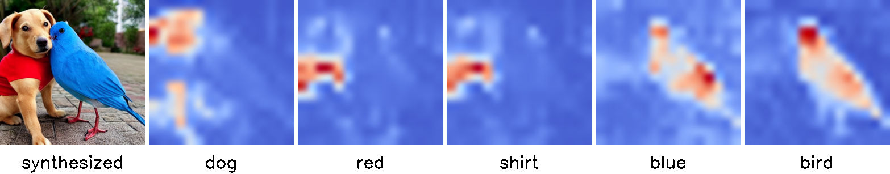
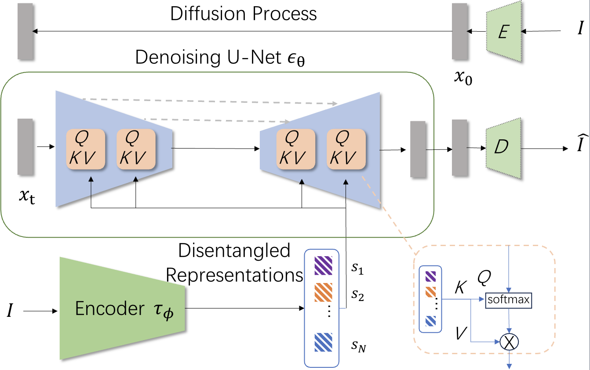

# Diffusion Model with Cross Attention as an Inductive Bias for Disentanglement
<a href="https://arxiv.org/pdf/2402.09712"></a>
<a href="https://opensource.org/licenses/MIT"></a>

This is the official PyTorch implementation of NeurIPS 2024 Spotlight paper: Diffusion Model with Cross Attention as an Inductive Bias for Disentanglement
[Arxiv](https://arxiv.org/pdf/2402.09712) | [OpenReview](https://openreview.net/forum?id=StapcUWm9q)).

> **Diffusion Model with Cross Attention as an Inductive Bias for Disentanglement** <br>
> Tao Yang, Cuiling Lan, Yan Lu, Nanning Zheng <br>
> *arXiv preprint arXiv:2402.09712*<br>
> *NeurIPS 2024 (Spotlight)*<br>

We introduce a new perspective, demonstrating that diffusion models with cross attention can serve as a powerful inductive bias to facilitate the learning of disentangled representations. We propose to encode an image to a set of concept tokens and treat them as the condition to the latent diffusion for image reconstruction. The interaction between the encoder and diffusion is bridged by cross attention over the concept tokens. Without any additional regularization, this framework achieves superior disentanglement performance on the benchmark datasets.

<p align="center">
    

    Figure 1: Average attention map across all time steps in stable diffusion. We draw inspiration from the process of text-to-image generation using a diffusion model with cross attention. Utilizing the highly “disentangled” words as the condition for image generation, the cross attention maps observed from diffusion model exhibit a strong text semantic and the spatial alignment, indicating the model is capable of incorporating each individual word into the generation process for final semantic aligned generation. This leads us to question whether such a diffusion structure could be inductive to disentangled representation learning.
</p>


We endeavor to investigate this question above and explore the potential of diffusion models in disentangled representation learning. For the first time, we discover that diffusion model with cross attention can serve as a strong inductive bias to drive disentangled representations, even without any additional regularization. As illustrated in Figure 2, we employ an encoder to transform an image into a set of concept tokens, which we treat them as “word” tokens, acting as the conditional input to the latent diffusion model with cross attention. Here cross attention bridges the interaction between the diffusion network and the image encoder. We name this scheme as EncDiff. EncDiff is powered by two valuable inductive biases, i.e., information bottleneck in diffusion, and the cross attention for fostering “word” (concept token) and spatial alignment, benefiting the disentanglement.

<p align="center">
    

    Figure 2: Illustration of our framework EncDiff. We employ an image encoder to transform an image into a set of disentangled representations, which we treat them as the conditional input to the latent diffusion model with cross attention. Here cross attention bridges the interaction between the diffusion network and the image encoder. For simplicity, we only briefly show the diffusion model which consists of an encoder, a denoising U-Net and a decoder that reconstructs the image from the latent.
</p>


## requirements
A suitable conda environment named encdiff can be created and activated with:
```bash
conda env create -f environment.yaml
conda activate encdiff
```
# Usage


```python
from ldm.util import instantiate_from_config
from omegaconf import OmegaConf
cli = OmegaConf.from_dotlist(unknown)
configs = [OmegaConf.load(cfg) for cfg in opt.base]
config = OmegaConf.merge(*configs, cli)

model = instantiate_from_config(config.model)
```
## Datasets
Download datasets for training EncDiff (Shapes3D as an example)

- [Download MPI3D_toy](https://github.com/rr-learning/disentanglement_dataset)
- [Download Shapes3D](https://github.com/google-deepmind/3d-shapes)

Manully set "/path/to/your/datasets/" in the following scripts in ldm/data/dis.py, e.g., For Shapes3D. We set the following script for setting dataset path.
```python
class Shapes3DTrain(Shapes3D):
    def __init__(self, **kwargs):
        super().__init__(path='/path/to/your/datasets/',
                original_resolution=None,
                **kwargs)
```
Dataset path structure:

```
/path/to/your/datasets/
├──shapes3d/3dshapes.h5
├──mpi_toy/mpi3d_toy.npz
├──...
```


## Trianing of EncDiff
Similar to LDM, the experiments are conducted by `main.py` script. The models are trained with this script with different configs. Before training EncDiff, we first need to train a VQVAE/VAE in the following.

### Train VQVAE/VAE for EncDiff
`main.py` script conducts the training of EncDiff, we choose a config file for it to train our VQVAE/VAE. For example, we can choose `configs/autoencoder/{dataset}_vq_4_16.yaml`. A VQVAE/VAE can be trained with the following commend:

```sh
python main.py --base configs/autoencoder/{dataset}_vq_4_16.yaml -t --gpus 0,
```

`dataset` can be {cars3d, shapes3d, mpi3d, celeba}.  As an  example, we can choose `dataset` as shapes3d:

```sh
python main.py --base configs/latent-diffusion/shapes3d-vq-4-16.yaml -t --gpus 0,
```

### Train EncDiff
`mai_valn.py` is the main script to train EncDiff with pretrained VQVAE/VAE. After the VQ-VAE is trained we set the checkpoint path of the pretrained model as follows: "ckpt_path: /my/vae_checkpoint/path" in each config file, e.g., configs/latent-diffusion/shapes3d-vq-4-16.yaml. We then can train a LDM for the pretrained VQVAE/VAE with the following commend:

```sh
python main_val.py --base configs/latent-diffusion/{dataset}_vq_4_16.yaml -t --gpus 0,
```
Logs and checkpoints for trained models are saved to `logs/<START_DATE_AND_TIME>_<config_spec>`.


# Pretrained Models
- [Download MPI3D_toy](https://github.com/rr-learning/disentanglement_dataset)
- [Download Shapes3D](https://github.com/google-deepmind/3d-shapes)


# Acknowlegement
Note that this project is built upon [LDM](https://github.com/CompVis/latent-diffusion) and [DisDiff](https://github.com/ThomasMrY/DisDiff). The eveluation code is built upon [disentanglement_lib](https://github.com/google-research/disentanglement_lib).

# Citation

```bibtex
@article{Tao2024EncDiff,
  title={Diffusion Model with Cross Attention as an Inductive Bias for Disentanglement},
  author={Yang, Tao and Wang, Yuwang and Lu, Yan and Zheng, Nanning},
  journal={NeurIPS},
  year={2024}
}
```